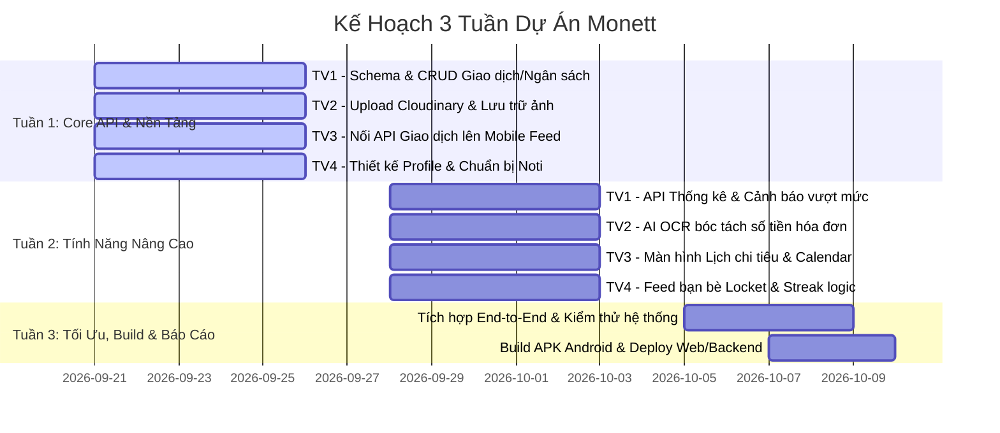

# Kế Hoạch Triển Khai & Phân Bổ Nhiệm Vụ 4 Thành Viên (Monett Project)

> **Dự án:** Monett - Fintech x Visual Moments Diary  
> **Kiến trúc:** Monorepo (`apps/backend` NestJS + `apps/mobile-web` React Native / Expo Web + `packages/shared`)  
> **Mô hình phân công:** Feature-driven (Mỗi thành viên phụ trách trọn vẹn một nhánh chức năng từ Web, Mobile đến Backend API).

---

## 📊 Bảng Ma Trận Phân Bổ Nhiệm Vụ (Team Allocation Matrix)

| Thành viên | Chức năng chủ đạo | 🌐 Nhiệm vụ Web | 📱 Nhiệm vụ Mobile | ⚙️ Nhiệm vụ Backend & API |
| :--- | :--- | :--- | :--- | :--- |
| **Thành viên 1** | **Quản lý Giao dịch & Ngân sách** | Bảng danh sách thu chi, bộ lọc, Modal thiết lập ngân sách tháng | Thẻ ngân sách Emerald Card, Form ghi chép chi tiêu nhanh | CRUD Giao dịch & Ngân sách (`/api/transactions`, `/api/budgets`) |
| **Thành viên 2** | **Khoảnh khắc Ảnh, Camera & AI OCR** | Album ảnh hóa đơn (Gallery Grid), Modal xem/phóng to ảnh hóa đơn | Camera Locket, Chọn ảnh thư viện, Tích hợp AI quét hóa đơn | Upload Cloudinary & AI OCR bóc tách hóa đơn (`/api/upload`, `/api/ocr`) |
| **Thành viên 3** | **Báo cáo Thống kê & Lịch Chi tiêu** | Bảng phân tích tài chính chi tiết, Biểu đồ cột/tròn thu - chi | Lịch chi tiêu (Calendar View), Biểu đồ mini & Mẹo tài chính | API Báo cáo & Thống kê theo ngày/tháng (`/api/analytics`) |
| **Thành viên 4** | **Bạn bè, Chuỗi Streak & Tài khoản** | Trang cá nhân Web, Cài đặt tài khoản, Mã QR kết bạn | Feed ảnh chi tiêu bạn bè (Locket), Thả cảm xúc, Push Noti Streak | API Bạn bè, Cảm xúc & Streak (`/api/friends`, `/api/streak`) |

---

## 🧩 CHIẾN LƯỢC TRIỂN KHAI DASHBOARD (TÍCH HỢP CHUNG THEO WIDGET)

> [!IMPORTANT]
> **Quyết định kiến trúc:** Nhóm **KHÔNG** giao riêng Dashboard cho 1 người làm độc lập, mà **cả 4 thành viên cùng hoàn thiện Dashboard theo dạng các mảnh ghép (Component-Driven / Widgets)**.
> 
> * **Lý do:** Dashboard thực chất là một "Hub tổng hợp" chứa các widget con từ tất cả các tính năng. Nếu 1 người chỉ làm Dashboard sẽ bị nghẽn (phải ngồi chờ 3 bạn còn lại làm xong API mới có data) và gây mất cân bằng khối lượng công việc.
> * **Giải pháp tránh xung đột Git (Merge Conflict):** Màn hình chính (`HomeScreen.tsx` và `MobileHomeScreen.tsx`) đã có sẵn layout khung sườn. Mỗi thành viên sẽ tạo **file Component Widget riêng** trong thư mục `src/components/dashboard/`, sau đó chỉ cần import vào Dashboard!

### Bảng phân chia Widget trên Dashboard cho từng bạn:

```
┌────────────────────────────────────────────────────────────────────────┐
│                      MONETT DASHBOARD (MÀN HÌNH CHÍNH)                 │
├────────────────────────────────────────────────────────────────────────┤
│ [TV4] Header Profile, Nút cài đặt & Ngọn lửa Chuỗi Streak 🔥           │
│       -> Component: <StreakBadgeWidget /> & <UserProfileHeader />      │
├────────────────────────────────────────────────────────────────────────┤
│ [TV1] Thẻ Hạn Mức Ngân Sách Xanh Ngọc (Emerald Budget Card) & Số Dư    │
│       -> Component: <BudgetCardWidget />                               │
├────────────────────────────────────────────────────────────────────────┤
│ [TV3] Dải Lịch 7 Ngày Tuần & Biểu Đồ Mini Thu Chi                      │
│       -> Component: <WeeklyCalendarWidget /> & <MiniAnalyticsWidget /> │
├────────────────────────────────────────────────────────────────────────┤
│ [TV4] Lời Nhắn Thông Minh & Cảm Xúc Chú Ếch Monett                     │
│       -> Component: <MonettFrogTipWidget />                            │
├────────────────────────────────────────────────────────────────────────┤
│ [TV2] Dải Xem Nhanh Ảnh Hóa Đơn Mới Chụp (Photobooth Moments Strip)   │
│       -> Component: <MomentsPreviewStrip />                            │
├────────────────────────────────────────────────────────────────────────┤
│ [TV1] Danh Sách Giao Dịch Thu Chi Hôm Nay                              │
│       -> Component: <RecentTransactionsWidget />                       │
└────────────────────────────────────────────────────────────────────────┘
```

---

## 👤 CHI TIẾT NHIỆM VỤ TỪNG THÀNH VIÊN

### 1. THÀNH VIÊN 1: Quản lý Giao dịch & Hạn mức Ngân sách
* **Mục tiêu:** Xây dựng luồng nhập liệu, tính toán tiền nong, số dư và ngân sách tháng xuyên suốt cả 2 nền tảng.
* **🌐 Phần Web (`apps/mobile-web/src/screens/web/`):**
  * **Bảng danh sách giao dịch chi tiết (Transaction Table):**
    * Hiển thị bảng thu chi dạng danh sách lớn: Tên món, danh mục, thời gian, số tiền (xanh cho thu / đỏ cho chi), ghi chú.
    * Tính năng tìm kiếm theo từ khóa, lọc theo danh mục (Ăn uống, Mua sắm, Di chuyển...) và sắp xếp theo ngày/số tiền.
    * Nút chỉnh sửa và xóa giao dịch trực tiếp trên bảng.
  * **Hộp thoại thiết lập Ngân sách tháng (Budget Modal):**
    * Giao diện nhập hạn mức lương/chi tiêu trong tháng (ví dụ: 20.000.000đ).
    * Thanh tiến độ phần trăm chi tiêu kèm cảnh báo đổi màu (xanh: an toàn, vàng: trên 80%, đỏ: vượt ngân sách).
  * **Widget Dashboard:** Code `<BudgetCardWidget />` và `<RecentTransactionsWidget />` cho Web Dashboard.
* **📱 Phần Mobile (`apps/mobile-web/src/screens/mobile/`):**
  * **Thẻ Hạn mức Ngân sách (Emerald Budget Card):**
    * Hoàn thiện thẻ màu xanh ngọc trên màn hình chính: hiển thị số dư khả dụng tháng, tổng tiền đã chi và thanh phần trăm còn lại.
  * **Form Thêm Chi Tiêu Nhanh (Quick Add Sheet):**
    * Giao diện Modal trượt từ dưới lên để nhập nhanh chi tiêu bằng tay (không cần chụp ảnh) khi đang vội.
  * **Danh sách chi tiêu hôm nay:**
    * Hiển thị danh sách thẻ chi tiêu thu gọn, chạm để xem chi tiết hoặc vuốt để xóa.
* **⚙️ Phần Backend & API (`apps/backend/src/`):**
  * Thiết kế Mongoose Schema: `Transaction` & `Budget`.
  * Xây dựng Controller & Service:
    * `POST /api/transactions`: Tạo giao dịch mới.
    * `GET /api/transactions`: Lấy danh sách giao dịch (phân trang, lọc danh mục, theo khoảng thời gian).
    * `PUT /api/transactions/:id` & `DELETE /api/transactions/:id`: Cập nhật / xóa giao dịch.
    * `GET /api/budgets/current`: Lấy số dư và hạn mức chi tiêu tháng hiện tại.
    * `POST /api/budgets`: Thiết lập hạn mức ngân sách mới.

---

### 2. THÀNH VIÊN 2: Khoảnh khắc Ảnh, Camera & Quét Hóa đơn AI
* **Mục tiêu:** Phát triển tính năng cốt lõi tạo nên sự khác biệt của Monett (kết hợp chụp ảnh hóa đơn phong cách Locket + AI bóc tách tự động).
* **🌐 Phần Web (`apps/mobile-web/src/screens/web/`):**
  * **Thư viện Album Khoảnh khắc (Photo Moments Gallery):**
    * Giao diện lưới ảnh (Grid Layout) hiển thị tất cả các bức ảnh hóa đơn/bữa ăn đã lưu.
    * Bộ lọc xem ảnh theo tuần / theo tháng.
  * **Modal Xem Chi Tiết Ảnh (Photo Lightbox):**
    * Bấm vào ảnh để phóng to toàn màn hình, hiển thị kèm hóa đơn, số tiền và lời nhắn kỷ niệm ngày hôm đó.
  * **Widget Dashboard:** Code `<MomentsPreviewStrip />` (dải ảnh khoảnh khắc photobooth) trên Dashboard.
* **📱 Phần Mobile (`apps/mobile-web/src/screens/mobile/`):**
  * **Hoàn thiện Giao diện Camera Locket (`MobileCameraScreen.tsx`):**
    * Kết nối chụp ảnh thực tế qua `CameraView`, nút Flash (⚡), Zoom 1x/2x, lật camera trước/sau.
    * Nút chọn ảnh trực tiếp từ Thư viện Album điện thoại (`expo-image-picker`).
  * **Tích hợp AI Quét Hóa đơn (Smart Receipt Scanner):**
    * Khi chụp ảnh hóa đơn xong -> Gọi API AI bóc tách -> Tự động nhận diện và điền sẵn **Số tiền** vào ô mà người dùng không cần gõ phím.
  * **Modal Lưu Khoảnh Khắc Chi Tiêu:**
    * Xem trước ảnh vừa chụp, gán danh mục nhanh và bấm lưu vào ví.
* **⚙️ Phần Backend & API (`apps/backend/src/`):**
  * **Dịch vụ Lưu Trữ Ảnh Đám Mây (`StorageModule`):**
    * Tích hợp Cloudinary hoặc Firebase Storage / S3.
    * Viết `POST /api/upload`: Nhận file ảnh từ client, nén ảnh và trả về link ảnh `https://...` vĩnh viễn.
  * **Dịch vụ AI OCR (`OcrModule`):**
    * Viết `POST /api/ocr/scan`: Nhận ảnh hóa đơn -> dùng Google Cloud Vision / Mindee để bóc tách số tiền, ngày giờ.

---

### 3. THÀNH VIÊN 3: Báo cáo Thống kê & Lịch Chi tiêu
* **Mục tiêu:** Cung cấp góc nhìn tài chính trực quan, biểu đồ phân tích và lịch theo dõi biến động dòng tiền.
* **🌐 Phần Web (`apps/mobile-web/src/screens/web/`):**
  * **Bảng Báo cáo Phân tích Tài chính (Financial Analytics Dashboard):**
    * Biểu đồ tròn (Pie Chart): Tỷ trọng chi tiêu theo từng danh mục (Ăn uống, Shopping, Đi lại...).
    * Biểu đồ cột (Bar Chart): So sánh dòng tiền Thu nhập vs Chi tiêu qua từng tháng trong năm.
    * Thẻ tổng kết: Số tiền tiết kiệm được trong tháng, mức chi trung bình ngày.
  * **Bộ xuất dữ liệu (Export Report):**
    * Tùy chọn xem báo cáo theo Tuần / Tháng / Quý / Năm.
  * **Widget Dashboard:** Code `<MiniAnalyticsWidget />` (biểu đồ tròn tóm tắt nhanh) trên Dashboard.
* **📱 Phần Mobile (`apps/mobile-web/src/screens/mobile/`):**
  * **Màn hình Lịch Chi Tiêu (Calendar View):**
    * Dải chọn ngày trong tuần và lịch tháng trực quan trên điện thoại.
    * Chạm vào ngày bất kỳ (ví dụ: ngày 18) -> Tự động lọc ra đúng các món đã tiêu và ảnh hóa đơn của ngày hôm đó.
  * **Widget Dashboard:** Code `<WeeklyCalendarWidget />` (dải chọn ngày 7 ngày trong tuần) trên Mobile Home.
* **⚙️ Phần Backend & API (`apps/backend/src/`):**
  * **Xây dựng Module Thống kê (`AnalyticsModule`):**
    * `GET /api/analytics/overview`: Tổng thu, tổng chi, số tiền tiết kiệm trong kỳ.
    * `GET /api/analytics/category-breakdown`: Tỷ lệ phần trăm và tổng tiền của từng nhóm danh mục.
    * `GET /api/analytics/monthly-comparison`: Dữ liệu 6 tháng gần nhất để vẽ biểu đồ so sánh.
    * `GET /api/transactions/by-date?date=...`: Lọc giao dịch và ảnh theo ngày đã chọn.

---

### 4. THÀNH VIÊN 4: Bạn bè, Chuỗi Streak & Tài khoản
* **Mục tiêu:** Xây dựng tính năng giữ chân người dùng (Gamification), kết nối bạn bè chia sẻ khoảnh khắc như Locket và quản lý Profile.
* **🌐 Phần Web (`apps/mobile-web/src/screens/web/`):**
  * **Trang Quản lý Tài khoản (Web Profile Screen):**
    * Xem và cập nhật thông tin cá nhân (Tên hiển thị, đổi Avatar, đổi mật khẩu).
    * Chuyển đổi ngôn ngữ Tiếng Việt 🇻🇳 / English 🇺🇸.
    * Hiển thị mã QR cá nhân để bạn bè dùng điện thoại quét kết bạn nhanh.
  * **Widget Dashboard:** Code `<UserProfileHeader />` và `<StreakBadgeWidget />` trên đầu trang Dashboard.
* **📱 Phần Mobile (`apps/mobile-web/src/screens/mobile/`):**
  * **Bảng tin Bạn bè (Locket Friends Feed):**
    * Tab xem những bức ảnh khoảnh khắc chi tiêu mới nhất của bạn bè trong ngày.
    * Thanh thả biểu cảm cảm xúc nhanh (❤️, 🔥, 👏, 😂, 💸) ngay dưới ảnh của bạn bè.
  * **Tính năng Kết bạn & Mời bạn (`Mời` Pill):**
    * Bấm nút "Mời" ở góc trên màn hình camera -> Hiện link chia sẻ hoặc quét mã QR kết bạn.
  * **Widget Dashboard:** Code `<MonettFrogTipWidget />` (chú ếch Monett hiển thị lời nhắn thông thái) trên Mobile.
  * **Thông báo nhắc nhở (Push Notifications):**
    * Cài đặt nhắc nhở tự động lúc 20:00 hàng ngày: *"Đừng quên chụp lại khoảnh khắc chi tiêu hôm nay để bảo toàn chuỗi Streak nhé!"*.
* **⚙️ Phần Backend & API (`apps/backend/src/`):**
  * **Module Bạn bè & Tương tác (`FriendsModule`):**
    * Schema `Friendship` và `MomentReaction`.
    * `POST /api/friends/add`: Gửi yêu cầu và kết bạn qua mã ID / QR.
    * `GET /api/moments/feed`: Lấy danh sách ảnh chi tiêu công khai của bạn bè.
    * `POST /api/moments/:id/react`: Thả cảm xúc vào ảnh.
  * **Module Gamification (`GamificationModule`):**
    * Logic tự động kiểm tra mỗi ngày để duy trì hoặc reset số ngày Streak.
  * **Cập nhật User Profile (`UsersModule`):**
    * `PUT /api/users/profile`: Cập nhật ảnh đại diện và tên người dùng.

---

## 📅 Lộ Trình Thực Hiện Đề Xuất (3 Tuần)



---

## 🌿 Quy Tắc Quản Lý Nhánh Git (Git Branching Strategy)

* **Nhánh chính:** `main` (Chỉ merge code đã chạy ổn định và không có lỗi biên dịch).
* **Các nhánh tính năng (Feature Branches):**
  * Thành viên 1: `feat/transactions-budget`
  * Thành viên 2: `feat/camera-moments-ocr`
  * Thành viên 3: `feat/analytics-calendar`
  * Thành viên 4: `feat/friends-streak-profile`
* **Quy trình merge:**
  1. `git pull origin main` về nhánh của mình để cập nhật code mới nhất.
  2. Test chạy thử: `npm run dev` ở mobile và backend.
  3. Tạo Pull Request (PR) lên `main` và báo nhóm review trước khi merge.
